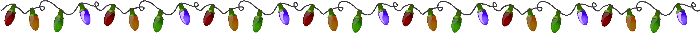

CoderDojo Merry Christmas
==========================

Ho, Ho, Ho, Merry Christmas to you all.  Lets take the excitement and fun
around Christmas and develop your very own customised CoderDojo Christmas Card.

## Programming learning objectives
* Variables
* Functions
* Functions with parameters
* Arrays
* 2D arrays
* if and else logic
* Recursive
* Add html from JavaScript
* for loops

## Game aims
* Build the web page
	* Background
	* Ground
	* Add lights
	* Merry Christmas message
* Build the tree
* Add the sleigh and fly across the screen
* Drop the present
* Let it snow

Well alot to do so lets get started.

## Build the web page

How do we start every webpage? Lets see how much you know can you add

Start by creating the necessary files in a folder called Christmas on 
your Desktop, its just easy to find it there

* index.html
* style.css
* christmas.js

Ok jump into into your html code on index.html and write the followign tags
* html tags
* head tag
* body tag
* link the css (style.css)
* link the javascript (christmas.js)

````html
<html>
	<head>
		<title>CoderDojo DCU Merry Christmas </title>
		<link rel="stylesheet" type="text/css" href="style.css"/>
		<script type="text/javascript" src="christmas.js"></script>
	</head>
	
	<body>
	</body>
	
</html>
````

### Time to add jquery

Want to use the coolest web framework out there? Well we do its alot of
fun and makes our game development easier.  Here you will need to add 
jquery.js just like you added christmas.js

````html

	<script type="text/javascript" src="jquery.js"></script>
````

You will need to add jquery.js to your christmas folder from https://raw.github.com/CoderDojo/htmlgamedev/master/christmascard/jquery.js

Now add it inside your head tags like below

````html
<html>
	<head>
		<title>CoderDojo DCU Merry Christmas </title>
		<link rel="stylesheet" type="text/css" href="style.css"/>
		<script type="text/javascript" src="christmas.js"></script>
		<script type="text/javascript" src="jquery.js"></script>
	</head>
	
	<body>
	</body>
	
</html>
````

## Add some festive colour

Lets move to the style.css file and add some background color
* Set the background-color to red
* Set the margin and padding to 0px so there is not spacing issues
with our inner divs

````css
body {
	background-color: red;
	margin: 0px;
	padding: 0px;
}
````

Now open index.html in your browser and look at your festive background

## Add some snow to the ground

Anyone got an idea how we going to add snow to the ground? We want a layer
of snow where can building our christmas tree on.  You are right use 
a div and place it at the bottom of the screen.  Add the div tag inside
your body tag like so

````html

<div id="ground">
		</div>

````

Now add the css to turn the ground white any idea what we need to add
* Background color white
* Position to the bottom
* Height of 100px
* Full width 
* Small border on top

````css
div#ground {
	position: absolute;
	border-top: 1px solid black;
	background-color: white;
	height: 100px;
	width: 100%;
	bottom: 0px;
	z-index: -100px;
}
````

## Lets light up this party

OK how about we add the christmas lights, check out the image file christmaslights.gif.  
Can you create a div just inside your body tags and add the lights.

````html
<div id="christmaslights">
			
		</div>
````
Now refresh your browser and the lights should be at the top of your page.

## Merry Christmas

Now that we have lit up our christmas card its time to add our Christmas cheer main message.

