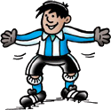

001 Build the webpage 
===================================

Ever wonder why England never win a penatly shoot out? Its because they
never attended CoderDojo to understand the logic behind a great penality.  

Aim
---------

* What is HTML / CSS
* What is tags
* How to start a HTML page
* Link the css file
* Introduce CSS (tags, class and id styling)
* Putting image into CSS

Game aim
-----------
* Background
* Sky
* Goal posts
* Keeper

Ok so lets get started.

What is HTML
-------------
Its the language of the Internet, Hyper Text Markup Language is used by every page you 
see online from facebook to google. This is possible as browsers like Firefox and Chrome 
intrepret this language and displays your content.  You primary use HTML to add
your text, images and layout.

What is CSS
------------
Want you website to look cool then, CSS is the language for you.  Cascading
Style Sheet language styles your pages to make them look amazing.  Its all about
the color and positioning.

What is tags
-----------
Ok who knows what a tag is? Tags are individual parts of the HTML language.
Think what do you see on your webpage? 
* Title
* Images
* Videos

They are all tags, so lets get started a tag, a tag has a name i.e. 
the image tag, is img.  Every element starts with 

How to open tag
'<' tagname '>' 
Close tag with the /
'</' tagname '>'

Sample tag below
````html
</img>
````

Tag rule
--------
We dont like having rules, but we do have one rule in HTML.
__For every tag you open you must close__

How to start a HTML page
-------
To start every page you create you will need the following tags
* html
* head
* body

````html
<html>
	<head> 
	
	</head>
	
	<body>
	
	</body>
</html>
````

Link the css file
----------
The CSS file is where we will put our styling, so create a new file
called style.css and save it in the same folder as your webpage.

Once you have created your file you are now ready to save the file

````html
<head>
	<link rel="stylesheet" type="text/css" href="style.css" />
</head>
````
Introduce CSS 
----

Lets get started on CSS, lets understand how the CSS maps from your html
code to the style.  There is 3 key ways you can style elements

__Style by tag name__

Style by tag name, ok lets see how we style every h1 tag

````html
<h1> </h1>
````
To style this tag h1 you can use simply use the tag name and add brackets

````css

h1 {
	font-weight: bold;
}

````

__Style by id__

Style by tag name, ok lets see how we style every h1 tag with an id mainTitle

````html
<h1 id="mainTitle"> </h1>
````

To style this tag h1 you can use simply use the tag name followed by a hash "#" and the id value so its

````css

h1#mainTitle {
	font-weight: bold;
}

````


__Style by class__

Style by tag name, ok lets see how we style every h1 tag with an class title

````html
<h1 class="title"> </h1>
````
To style this tag h1 you can use simply use the tag name followed by
dot and the class value so its

````css
h1.title {
	font-weight: bold;
}

````

The main difference between class and id is that, id
should only ever be used ONCE on your page.  While class
is there for styles you want to use more than once.


Lets plant some grass
-----------
Anyone got any ideas how we are going to plant the grass on the screen?

Well we are going to get the background setting for the webpage to handle
this.  To set the background we need to style the body tagc

````css
body {
	background: url(ground.gif);
	margin: 0px;
	color: green;
	padding: 0px;
}
````

Add the sky
-----------
Lets add the sky to our page?  Anyone got any idea how we are going 
to do this?

Well the answer is by a div

````html
<div id="sky">
</div>
````
Hey look here we are following our most important rule, for every tag
we open we close.

Ok what color do you want your sky to be? I went for skyblue.  To
set the background color you will need to set this in your css using 
the backgroud property.  
__Please ensure you close the line with a semicolan;__

````css
div#sky {
	background: skyblue;
}
````

If you view your page you will not see the sky, this is because you 
have not set the size of your div.  So lets go and set the width
and height.  We are setting the height to 200px and the width to 100%.

The width of 100% should take up the full screen width.  Now go back and 
check out in your browser.  You should now see you sky


````css
div#sky {
	
	width: 100%;
	height: 200px;

	background: skyblue;
}
````

How ever there is a problem as you sky does not touch the top of
browser and you can still see the grass in ares you dont want grass (i.e.
in the sky).  We need to position the sky correctly.

To start we need to set the position, first we will use the position
css property to decide the type of positioning, in this scenario we 
are going to use absolute.

### Position absolute
This position is set to an exact measure position of the browser and 
will not move.


### Position relative
This position is relavite to the element its inside.  

Here we are setting the sky to start up the top right of the screen, with
left and top 0px.

````css
div#sky {
	position: absolute;
	top: 0px;
	left: 0px;
	z-index: -100px;


	width: 100%;
	height: 200px;
	background: skyblue;
	border-bottom: 1px solid white;	
}
````
We are setting the border on the bottom here to have a small sepration
between sky and grass.

Build the goal posts
-----------
Lets build the goal posts.  To create the goals we will need to create
two divs, the first one shootArea will create a center div on page
where the goal, keeper and penalty spot will live. 

Inside the shootArea the first div we will add is the goal div.

````html
<!-- Shoot area -->
<div id="shootArea">
			<div id="goal">
			</div>
</div>
````
  
We will first have to style to shootArea to position it in the centre.
To do this we will give we will use the margin-left and margin-right 
properties.  To start we will set the position to relative.

To centre the shootArea on screen (because the goals are alway in 
middle of of pitch!).  We are first going to set the width of 350, 
then setting the margin-left and margin-right to auto.  Auto will decide
the margin based on the screen size, so should center this div.

### margin
Does anyone remember what the margin property does in CSS? It adds
spacing to the outside of the element, so here the space outside 
the left and right of shootArea will be increased.

````css
div#shootArea {
	position: relative;
	margin-left: auto;
	margin-right: auto;
	width: 350px;
}
````

There is some really missing from out football game? Well its the 
goal posts.  As you have already created the div style we now need
 to style it so go to your style.css file.  Can you think of a CSS property
 that will style our goal posts?  
 
Borders! How about we style border left, right and top? We will give 
them a size of 6px so they are big enough ont he screen.

````css
div#goal {
	border-top: 6px solid white;
	border-left: 6px solid white;
	border-right: 6px solid white;
}
````

Open the browser and lets see what you can see? probably nothing? 
Any idea why? Its because our div does not have any size? So lets add
the height and width to the style.

````css
div#goal {
	
	width: 350px;
	height: 150px;

	border-top: 6px solid white;
	border-left: 6px solid white;
	border-right: 6px solid white;
}
````

Now refresh this in your browser and see how you are getting on?  The 
position is probably not right? So lets set the position, left and top
until we are happy with the position.  Change the number values for 
top and left and see your goal posts move.

````css
div#goal {
	position: absolute;
	left: 50px;
	top: 50px;
	
	width: 350px;
	height: 150px;

	border-top: 6px solid white;
	border-left: 6px solid white;
	border-right: 6px solid white;
}
````

Add the keeper
-----------
Time to put the goal keeper in the goal, to do this you need to use
a new tag for image call img and link the Keeper image.  As the goal 
keeper is in goal we are going to put him inside the goal div! So create
a new div with an id keeper and we will add the img tag inside it.

````html
			<div id="goal">
				<div id="keeper">
					
				</div>
			</div>
````
The img tag takes in one key property __src__, this property links
the image tag to your file, so will you will need to add the exact
name of your image including the type here.  __PLEASE ENSURE ITS THE
SAME CASE, SO IF THERE IS CAPITIALS IN THE NAME THEY MUST BE ADDED
TO SRC__. You will also need to ensure Keeper.png is in the same folder
as your webpage.    

To enable the div control the sizes the webpage we will set the size of
every image to 100%;

````css
img {
	width: 100%;
}
````

Now we just need to style the div, lets set the position to relative and you
can play with the top value until the goals sits correctly on the grass.

````css
div#keeper {
	position: relative;
	top: 60px;
}
````

Conclusion
------------
Hope you guys enjoyed the start of our games course.
