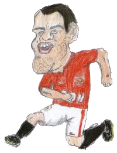

004 Bring Rooney into the Game
===================================

Ok we have a flying goalie, possibly the coolest goalie I you have 
ever seen.  Unlike most Irish goal keepers this guys can fly and 
actually save points.
 
Aim
---------
* Another look at functions
* Variables
* JQuery selectors
* CSS positioning
* How to style elements in JQuery

Game aim
-----------
* Build the penalty sport
* Add the ball
* Display rooney on the screen
* Make rooney run
* Kick the ball

Ok so lets get started.

Build the penalty sport
-------------
How can you penalty shoot game without a spot, well its time to add this to 
our game

To get started let think how we are going to add the penalty spot? Think
we will start with some HTML for the penalty spot

````html
<div id="penaltySpot">
			</div>
````

We have a div what css do we need to display?

````css
div#penaltySpot {
	position: absolute;
	-moz-border-radius: 25px;
	border-radius: 25px;
	background-color: white;
	height: 50px;
	width: 50px;
	top: 530px;
	border: 2px solid black;
	z-index: -100px;
	left: 150px;
}
````

Display the ball
------------

Whats a penalty spot without the ball, its time to a ball to our game finally,
Lets add some HTML for the ball can you give an idea what html 
tags we are going to use?

* div
* img

````html
<div id="ball" >
				
			</div>
````

Time to add some style to our ball, lets position it correctly on the
screen.

````css
div#ball {
	position: absolute;
	width: 30px;
	z-index: 100px;
	left: 160px;
	top: 540px;
}
````

Is there anything wrong with our image? 

````css
img {
	width: 100%;
}
````

Lets get rooney into our game
------------
Its time to get our key man into the game and why not get an english
player, gives to goal keeper a chance.  Rooney is one of Machester Unites
greater player of all time so an ideal image.  

What HTML should we add for this image

````html
<div id="rooney">
	
</div>			
````
Can you add this image directly below the ```` <div id="ball">```` and 
refresh your browser. Now we have a massive rooney, whats next? We need to style it

````css
div#rooney {
	position: absolute;
	top: 450px;
	width: 70px;
	left: 300px;
}
````

Now that rooney is looking game size its time to have a bit of fun and
make him run

Give rooney a run up
------------

Need to get rooney moving lets start adding some variables to the
top of javascript file directly below our keep

````javascript
//ball variables
var ball;
var penaltySpot;

//rooney variables
var rooney;
````

We have the variables setup we now need to declare them, lets create 
a function to do it

````javascript
function setupVariables() {
	ball  = $("#ball");
	penaltySpot = $("#penaltySpot");
  	rooney  = $("#rooney");
}
````

As we have already created a variable for keeper, think we should move it
into this function?  So lets do that

````javascript
function setupVariables() {
	//get the variables required from the HTML
	ball  = $("#ball");
	penaltySpot = $("#penaltySpot");
  	rooney  = $("#rooney");
  	keeper = $("#keeper");
}
````

Do we need to call this function? Lets do it from the setup function
as we need these variables for all our functions

````javascript
function setup() {

	setupVariables();
  	goalWidth=400;
  	
  	commenceGame();
}
````

We now need to trigger rooney to start running, from the HTML? We will 
start the rooney run up when you click the rooney image

We need to add onclick to the rooney div already in your HTML code

````html
<div id="rooney" onclick="rooneyStart()">
				
			</div>
````

We will also enable rooney to run on the space key being hit,
at the top of the file we will use the onkeypress to check 
what key was hit,

charKey 32 is the space key

````javascript
//handle the key events
document.onkeypress=function(e){
	var e=window.event || e;
	if(e.charCode==32) {
 		rooneyStart();
	}
}
````

What is the first function we need to write?  Its the rooneyStart one
the function we need to call, this function will

* Make sure the rooney is displaying on the screen
* Start the penatly setup
* Make rooney run

````javascript
function rooneyStart() {
	rooney.css('display', 'block');
	penaltySetup();
	rooneyRun();
}
````

Time to handle the basic penalty setup 
* Set the ball top position
* Set rooney left position

````javascript

function penaltySetup() {
  	
  	//15 is the half the width of the ball
  	ball.css('top','500px');
  	
  	rooney.css('left', '300px'); //ball position
}
````

Now that rooney needs to run up to the ball so we will create a function
to handle that.  This function is going to get rooney to run towards the
ball and stop when we reach the ball

What we need to do is,
* First need to set the ball position, the shootArea is 350px and the ball 
is 45px, the ball is half way in the shoot area (margin-left:50%) so I am going to set the ball position
to be 200
* Lets get rooney's left position
* If the left position is not 200 move rooney 
* Recursively call this function until this position is reached

````javascript
function rooneyRun() {
	var ballPosition = 200;
	
	var rooneyPosition = parseInt(rooney.css('left'));
	if(ballPosition < (rooneyPosition)) {
		rooney.css('left',(rooneyPosition-5)+'px');
		setTimeout(rooneyRun,50);
	}  
}
````

Refresh your browser now and see you should see rooney running towards the ball. 


Kick the ball
------------

Its great to see the greatest striker of all time running freely up to the
ball but he really needs to get his game on here and kick the ball. What would 
we add to the function above to make rooney kick the ball.  There is something
we can do after the if is finished.  Lets but an ```` else ```` statement in
there and create a new function called rooneyKickBall.  So our rooneyRun
function now looks like

````javascript
function rooneyRun() {
	var ballPosition = 200;
	
	var rooneyPosition = parseInt(rooney.css('left'));
	if(ballPosition < (rooneyPosition)) {
		rooney.css('left',(rooneyPosition-5)+'px');
		setTimeout(rooneyRun,50);
	}  else {
		rooneyKickBall();
	}
}
````

To get started lets create our new function to kick the ball

````javascript

function rooneyKickBall() {

}

````

The first thing we need to do is make our rooney image dissapear. Any 
ideas, we did this early to make sure the image displayed as block
on the screen, go back up through the code and see if you can find
out which line displays the image in screen.

The code uses the css function provided to us by JQuery.  In this function
we are setting the display on rooney image so its

````javascript 
rooney.css('display', 'none');
````
Here we are using the display css property to hide the image
* Hide image value = none
* Show the image value = block

Our rooneyKickBall function should now look like this

````javascript

function rooneyKickBall() {
	rooney.css('display', 'none');
}

````

Now refresh the browser and see what happens.  

If we have hidden the rooney running image, the we now need to display
the rooney kick image check out __roo3.png__ file.  To make this image
display what is the first thing we need to do?

Ye you are right we need to add this image to our html code, so lets open 
index.html.   What html code add our image? and what HTML code do we 
always put around an image tag?

Time to add the image and div to our html code, add it directly below the rooney div.

````html
		<div id="rooneyKick">
			
		</div>
````

Refresh your browser and let us know what you think?  

Ok rooney kick is a bit on the big side, in the wrong position and is 
displaying on the screen even through we dont want to see him until
he has kicked the ball, what language will we use to fix this? 

Yes CSS you are right so lets open the style.css file, what is our first
line of code we are going to add to the end of this file to style the 
rooneyKick div?

We need to add the tag name (div), # to say we are matching on id and 
id value (rooneyKick)
````css
div#rooneyKick {

}
````
In this style we need to 
* add an exact position for the kick
* add the left position to be just right of the ball
* add the top to a position to rooney looks like he is kicking the ball
* resize rooney so he is a similar size as the rooney run

The following CSS achieves this 
* __position__ is enabling us set an exact position 

````css
div#rooneyKick {
	position: absolute;
	left: 200px;
	top: 430px;
	width: 100px;
}
````

Refresh your browser and let us know what you think, something still 
wrong here, yes you are right we can still see rooneyKick on the screen.

We will handle this in the javascript so time to get started.  As we 
are using a new image we need to add a new variable for this at the 
top of our javascript

````javascript
var rooneyKick;
````

Any idea how we going to declare this using jquery?  Lets go to the 
setupVariables function and add

````javascript
rooneyKick = $("#rooneyKick");
````

Here we are using jquery selector to get the rooneyKick div from html code
* $() - start of jquery selector
* # - use as we selecting by id
* rooneyKick - id value from html div tag

Our setupVariables function should now look like this

````javascript
function setupVariables() {
	//get the variables required from the HTML
	ball  = $("#ball");
	penaltySpot = $("#penaltySpot");
  	rooney  = $("#rooney");
  	keeper = $("#keeper");
  	
  	rooneyKick = $("#rooneyKick");
}
````

We can still see rooney on our screen so its time to hide him so navigate
to the penaltySetup function and add the code to hide the image, remember
we seen hiding rooney image earlier.  So any ideas what you need to do
to the rooneyKick variable

````javascript
rooneyKick.css('display', 'none');
````

Your penaltySetup function should now look like this

````javascript
function penaltySetup() {
  	ball.css('top','500px');
  	rooney.css('left', '300px'); 
  	rooneyKick.css('display', 'none');
}
````
Now refresh your browser and your rooneyKick should be gone.  Time to
finish rooneyKickBall function to make the rooneyKick image appear. Any
ideas here?

````javascript
rooneyKick.css('display', 'block');
````

The rooneyKickBall function should now look like this

````javascript

function rooneyKickBall() {
	rooney.css('display', 'none');
	rooneyKick.css('display', 'block');
}

````


